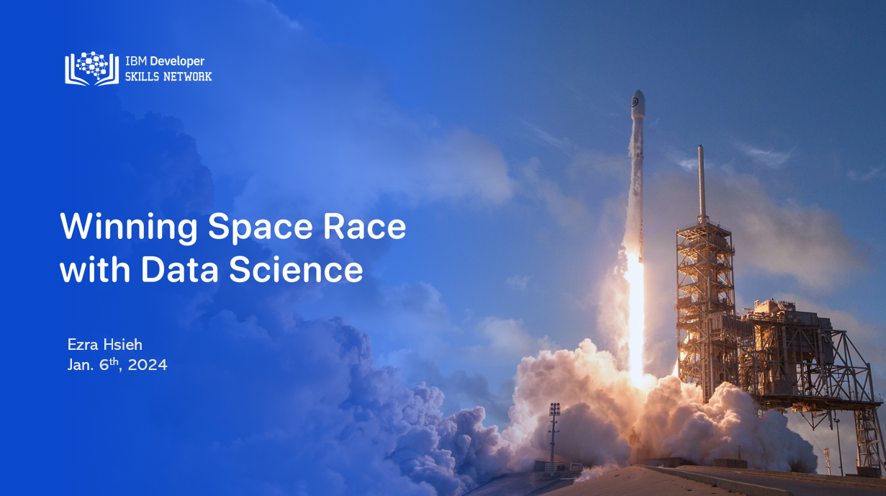
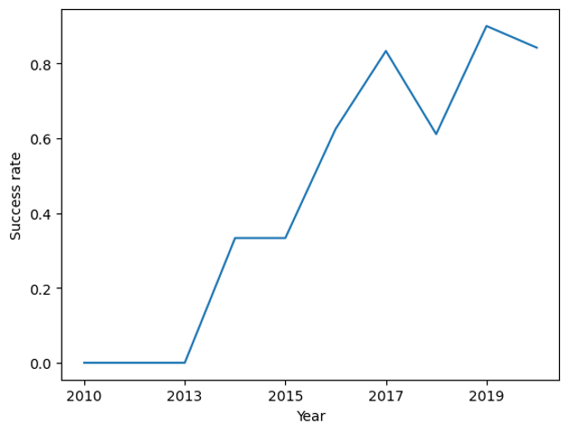
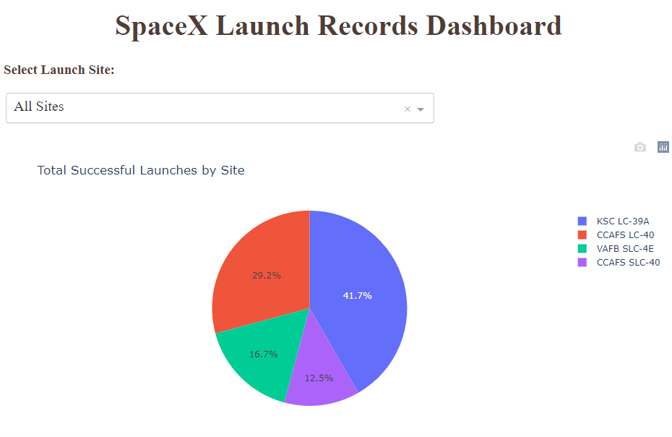
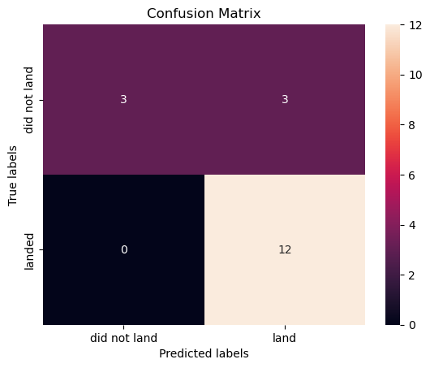

# SpaceX Rocket Landing Analysis & Prediction Project 🚀

## Executive Summary

Welcome to the SpaceX Rocket Stage One Landing Prediction project! The primary goal of this data science project is to model and predict the success of SpaceX's rocket stage one landing. Leveraging datasets obtained from SpaceX's API and related Wikipedia pages, I embarked on a comprehensive analysis using a variety of data science tools and techniques. This project serves as the final submission to the Applied Data Science Capstone Project taught by IBM; it is the final course required by the [IBM Data Science Professional Certificate](https://www.coursera.org/professional-certificates/ibm-data-science).

### Key Highlights:

- **Data Collection:** Relevant datasets from SpaceX's API and related Wikipedia pages formed the foundation for analysis.

- **Data Cleaning and Exploration:** The acquired datasets underwent meticulous cleaning, followed by exploratory data analysis. This phase utilized powerful tools such as pandas, matplotlib, and SQL to ensure the data was well-prepared for subsequent modeling.

- **Interactive Dashboards:** To facilitate visual analysis, interactive dashboards were crafted using Folium and Plotly Dash. These dashboards offer dynamic insights into the data, making it easier to identify patterns and trends.

- **Machine Learning Modeling:** Employing various machine learning algorithms, including logistic regression, Support Vector Machines (SVM), decision trees, and k-Nearest Neighbors, I aimed to develop accurate models predicting stage one landing success. Optimization techniques were applied to enhance model performance.

- **Correlating Attributes:** Notable attributes, such as the ordered number of launches, launching site, booster version, and payload mass, were identified as having potential correlations with landing success. These insights contributed significantly to my modeling approach.

- **Predictive Analysis Results:** My predictive analysis algorithms, developed through machine learning, demonstrated a commendable accuracy of 83.3% on test data. This outcome underscores the effectiveness of my predictive models in forecasting SpaceX's rocket stage one landing success.

### Full PDF Presentation Report

Read the full, detailed report with visualization example on this project [here](ds-capstone-coursera-spacex.pdf).

## Table of Contents

1. [**Introduction**](#introduction)

2. [**Methodology**](#methodology)
    - [Data Collection](#data-collection)
    - [Data Wrangling](#data-wrangling)
    - [Exploratory Data Analysis](#exploratory-data-analysis-eda)
    - [Interactive Visual Analytics](#interactive-visual-analytics)
    - [Predictive Analysis](#predictive-analysis)

3. [**Results**](#results)
    - [Exploratory Data Analysis](#exploratory-data-analysis-eda-1)
    - [Interactive  Analytics](#interactive-analytics)
    - [Predictive Analysis](#predictive-analysis-1)

4. [**Conclusion**](#conclusions)

5. [**Acknowledgment**](#acknowledgment)

## Introduction

SpaceX has consistently marked striking achievements in the aerospace industry. Notable accomplishments include successful missions to the International Space Station, the establishment of global satellite internet coverage through Starlink, and the realization of crewed spaceflights.

A key driver of SpaceX's cost efficiency is the reuse of the first stage in their Falcon 9 rocket launches. This innovative approach significantly distinguishes SpaceX from other providers, resulting in relatively inexpensive launches.

As a hypothetical competitor keen on understanding and predicting the dynamics of SpaceX's launches, this data science project aims to delve into various analyses. Primarily, I focus on predicting the success of each launch based on the critical factor of first stage reuse. Leveraging publicly available information and employing machine learning techniques, my goal is to unravel patterns and insights that contribute to forecasting the success of SpaceX's Falcon 9 rocket launches.

## Methodology

### Data Collection

Rocket launch data served as the foundation for my analysis, sourced from two primary channels:

- **SpaceX API:** Direct data retrieval from SpaceX's API provided detailed information on their Falcon 9 launches. See [notebook](jupyter-labs-spacex-data-collection-api.ipynb).

- **Wikipedia Scrapping:** Additional data was scraped from the Wikipedia page dedicated to SpaceX Falcon 9 launches. See [notebook](jupyter-labs-webscraping.ipynb).

### Data Wrangling

In this phase, meticulous data wrangling techniques were applied:

- **Focused Selection:** Only Falcon 9 launches were considered for analysis.

- **Handling Missing Values:** Missing values were addressed by filling them with the respective average values, ensuring the integrity of the dataset.

- **Attribute Relevance:** Irrelevant attributes were systematically removed, streamlining the dataset for subsequent analyses.

See [notebook](labs-jupyter-spacex-Data-wrangling.ipynb).

### Exploratory Data Analysis (EDA)

To gain meaningful insights, exploratory data analysis was conducted:

- **Visualization Techniques:** Utilizing various visualization tools, including matplotlib, pandas, and SQL, I delved into the dataset's nuances. See [notebook](jupyter-labs-eda-dataviz.ipynb).

- **SQL Exploration:** SQL queries were employed to extract specific information, providing a deeper understanding of the dataset. See [notebook](jupyter-labs-eda-sql-coursera_sqllite.ipynb).

### Interactive Visual Analytics

Interactive dashboards were created using Folium and Plotly Dash:

- **Folium:** Geographic visualizations provided spatial context to launch data. See [notebook](lab_jupyter_launch_site_location.ipynb).

- **Plotly Dash:** Dynamic dashboards facilitated real-time exploration of patterns and trends. View/Download the script and run the Dashboard [here](spacex_dash_app.py).

### Predictive Analysis

Predictive analysis focused on utilizing classification models:

- **Machine Learning Library:** Scikit-learn served as the primary library for building and testing my classification models.

- **Grid Search:** Model parameters were optimized through a meticulous Grid Search process, ensuring the models were finely tuned for accuracy.

See [notebook](SpaceX_Machine_Learning_Prediction_Part_5.jupyterlite.ipynb). 

The methodology outlined above forms the systematic approach undertaken to extract insights, predict outcomes, and present a comprehensive analysis of SpaceX's Falcon 9 launches.

## Results

### Exploratory Data Analysis (EDA)

- **Success Rates Over Time:** My analysis revealed a positive trend in SpaceX's success rates over the years, indicating an upward trajectory in their landing success.

### Interactive Analytics

- **Predictors of Success:** Interactive analytics unveiled significant predictors with relationships to launch success, including launching sites, booster versions, and payload masses.

### Predictive Analysis

- **Classification Models:** Logistic regression, Support Vector Machines (SVM), decision trees, and k-nearest neighbor models demonstrated virtually identifical robust capabilities in predicting launch outcomes, with an accuracy score of 83.3%.

## Conclusions

- **Cost Efficiency:** With the observed increase in SpaceX's landing success over time, there is a corresponding potential decrease in launch costs as more stage one boosters become reusable.

- **Competitive Landscape:** This poses challenges for competitors, as SpaceX's innovative approach continues to strengthen its position in the aerospace industry.

- **Correlation with Boosters and Sites:** The correlation between higher landing successes and newer booster versions, as well as launching sites, suggests the significance of continuous innovation and strategic site selection.

- **Future Data Collection:** Collecting more recent data post-2021 for training and testing classifier models will be instrumental in selecting the best model with a lower false positive rate.

## Acknowledgment

I extend my gratitude to the IBM Developer Skills Network for providing the Data Science Professional Certificate and facilitating this capstone project. Special thanks to instructors Joseph Santarcangelo and Yan Luo for their invaluable guidance.

I would also like to express my appreciation to Rav Ahuja, Lakshmi Holla, and Azim Hirjani for their contributions in creating the lab instructions, project guidelines, and skeleton codes, which significantly contributed to the success of this project.